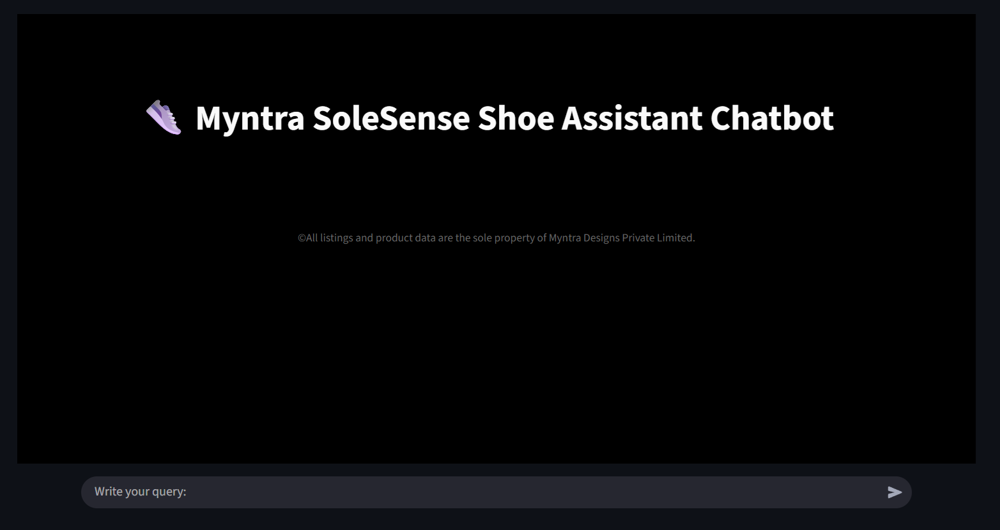
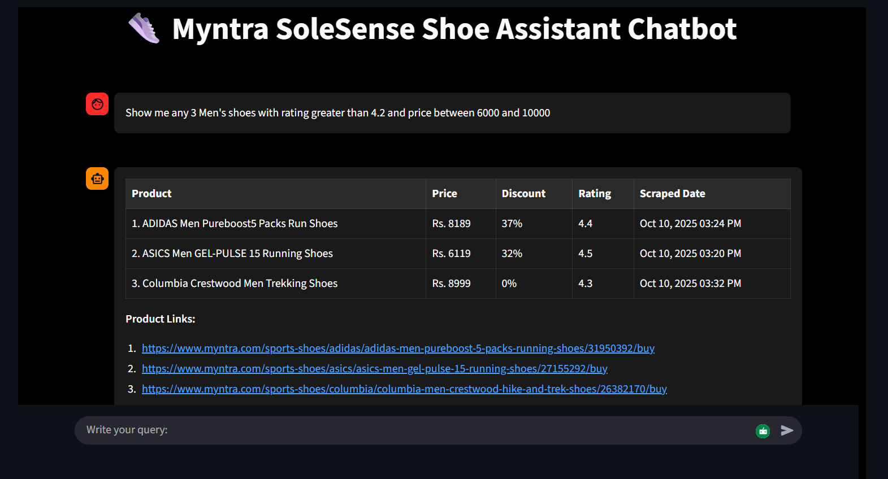
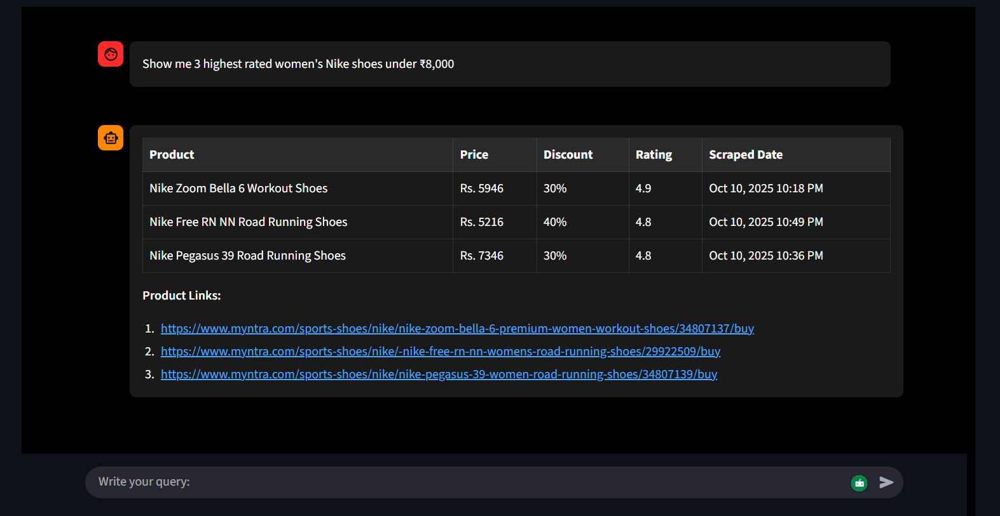
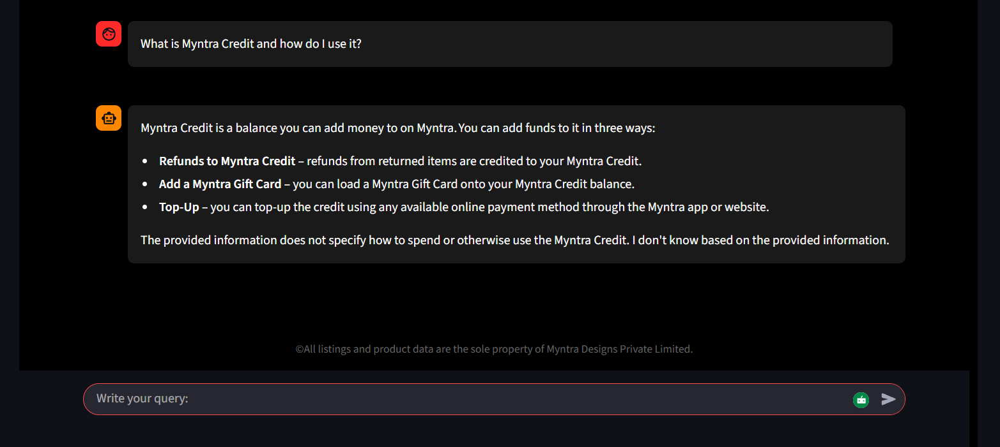
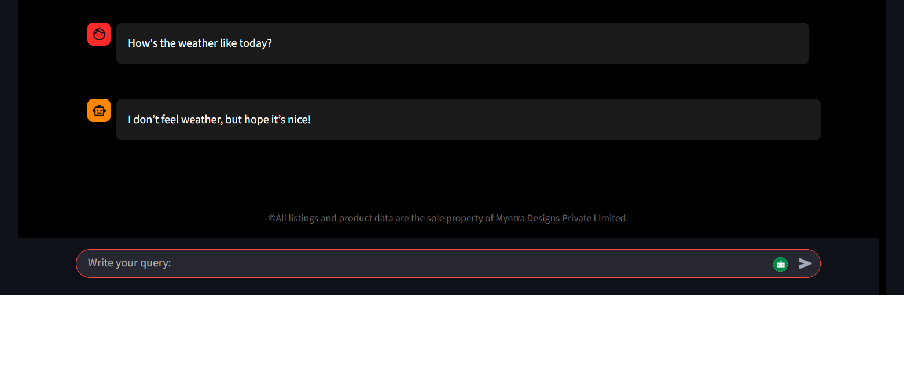

<p align="center">
  <!-- Replace the src with your own logo later if you want -->
  
</p>

<h2 align="center">MyntraSoleSense</h2>
<p align="center"><b>AI-powered sneaker discovery & recommendations using semantic search + LLM routing.</b></p>

<p align="center">
  <a href="https://streamlit.io/">
    
  </a>
  <a href="https://www.selenium.dev/">
    
  </a>
  <a href="https://www.crummy.com/software/BeautifulSoup/">
    
  </a>
  <a href="https://lxml.de/">
    
  </a>
  <a href="https://pandas.pydata.org/">
    
  </a>
  <a href="https://www.trychroma.com/">
    
  </a>
  <a href="https://www.sbert.net/">
    
  </a>
  <a href="https://pytorch.org/">
    
  </a>
  <a href="https://onnxruntime.ai/">
    
  </a>
  <a href="https://huggingface.co/docs/huggingface_hub">
    
  </a>
  <a href="https://groq.com/">
    
  </a>
  <a href="https://github.com/semantic-router/semantic-router">
    
  </a>
</p>

<p align="center">
  <b>Scraping:</b> Selenium + BeautifulSoup &nbsp; | &nbsp; <b>Vector DB:</b> ChromaDB &nbsp; | &nbsp; <b>NLP:</b> Sentence-Transformers + Torch &nbsp; | &nbsp; <b>UI:</b> Streamlit
</p>

<p align="center">
  MyntraSoleSense collects product pages, embeds product text, and retrieves the most relevant shoes via semantic search—then uses LLM routing to answer queries fast.
</p>

---

An intelligent chatbot assistant for Myntra's e-commerce platform that helps users find and explore shoes across various brands. The assistant combines natural language understanding with semantic search and database querying to provide accurate product information and support.

## 🚀 Features

- **Natural Language Product Search**: Find products using conversational queries
- **FAQ Support**: Get instant answers to common questions
- **Semantic Understanding**: Advanced NLP for better query comprehension
- **Multi-brand Support**: Extensive catalog from top brands
- **Intelligent Routing**: Automatically routes queries to the appropriate handler

## 🛠️ Technical Stack

- **Embedding Model**: `all-MiniLM-L12-v2` (Sentence Transformers)
- **LLM**: `openai/gpt-oss-120b` using Groq Cloud API
- **Vector Database**: ChromaDB for semantic similarity search
- **Structured Data**: SQLite3 for product catalog
- **Web Framework**: Streamlit for the frontend interface
- **Natural Language Processing**: Semantic Router for intent classification

---

## 📸 Screenshots


### 🖥️ Streamlit Application Interface


### ✅ Sample Results
#### Product Search


#### FAQ Related Queries

#### Small Talk


---


## 📦 Project Structure

```
Myntra_chat_assistant/
├── app/
│   ├── __pycache__/
│   ├── helper_functions/    # Utility functions and helpers
│   │   ├── csv_to_sqlite.py  # CSV to SQLite conversion utilities
│   │   ├── router.py         # Intent routing logic
│   │   └── embedding_function.py  # Custom CPU embedding implementation
│   ├── resources/           # Data files and resources
│   │   ├── Myntra_FAQ.csv   # FAQ knowledge base
│   │   └── myntra_db.sqlite # SQLite database
│   ├── web_scraper/         # Web scraping components
│   ├── .env                 # Environment configuration
│   ├── faq_route.py         # FAQ handling and semantic search
│   ├── frontend.py          # Streamlit UI and main application
│   ├── small_talk_route.py  # Conversational AI responses
│   └── sql_route.py         # SQL query generation and execution
├── .gitignore
├── LICENSE.md               # Project license
├── README.md
└── requirements.txt  
```

## 🛠️ Installation

1. **Clone the repository**
   ```bash
   git clone <repository-url>
   cd Myntra_chat_assistant
   ```

2. **Set up Python environment**
   ```bash
   python -m venv venv
   .\venv\Scripts\activate  # Windows
   source venv/bin/activate  # macOS/Linux
   pip install -r requirements.txt
   ```

3. **Configure environment variables**
   Create `.env` in the `app` directory with:
   ```
   GROQ_API_KEY=your_groq_api_key
   GROQ_MODEL=openai/gpt-oss-120b  # or your preferred model
   ```

4. **Run the application**
   ```bash
   cd app
   streamlit run frontend.py
   ```

## 🧠 Data & Catalog

- **Men's Shoes**: 1000+ products
- **Women's Shoes**: 1000+ products
- **Brands**: Nike, Adidas, Puma, Reebok, Skechers, Under Armour, and more
- **Product Details**: Prices, sizes, colors, ratings, discounts, and availability

## 🤖 How It Works

### 1. Intent Classification
- Uses Semantic Router to classify user intent into:
  - **FAQ**: Product policies, shipping, returns
  - **Product Queries**: Search and filter products
  - **Small Talk**: General conversation

### 2. Query Processing
- **For FAQ Queries**:
  - Embeds the question using Sentence Transformers
  - Performs semantic search in ChromaDB
  - Retrieves top-matching FAQ with answer
  - Uses LLM to generate natural response

- **For Product Queries**:
  - LLM converts natural language to SQL
  - Executes query on SQLite database
  - Formats results into natural language response
  - Includes product details and images

- **For Small Talk**:
  - Directly uses LLM for response generation
  - Maintains conversational context

## 🔍 Example Queries

### Product Search
```
- Show me 3 highest rated women's Nike shoes under ₹8,000
- Give me any 3 men's running shoes with at least 4.5 rating
- Show me any 3 men's shoes with rating greater than 4.2 and price between 6000 and 10000.
```

### FAQ Examples
```
- Do you accept EMI payments through credit card?
- What is Myntra Credit and how do I use it?
- How do I track my order?
- What's your return policy?
- How do I cancel an order?
- What payment methods do you accept?
```

### Small Talk
```
- How's the weather like today?
- How are you feeling?
- What's your name?
```

## 🚀 Extensibility

The current implementation focuses on shoes but can be extended to:
- Additional categories (topwear, bottomwear, accessories)
- More brands and products
- Enhanced filtering options

## 🚀 Version 2.0

Once launched, it will be able to handle more complex SQL queries, including sub-queries, CTEs, and other advanced query structures to make data retrieval even more powerful.

## 💻 Local Development with Ollama

For local development without Groq Cloud:
1. Install Ollama and download a model:
   ```bash
   ollama pull mistral
   ```
2. Update the code to use local LLM endpoint
3. Modify API calls to point to your local Ollama server

## 📝 Notes

- Requires Python 3.8+
- Chrome WebDriver needed for web scraping
- Environment variables for sensitive data
- SQLite database for product catalog
- ChromaDB for semantic search

## 📄 License

MIT License - See LICENSE for details.

---

*If your shoe hunt still takes longer than your checkout, you’re doing it wrong.*
